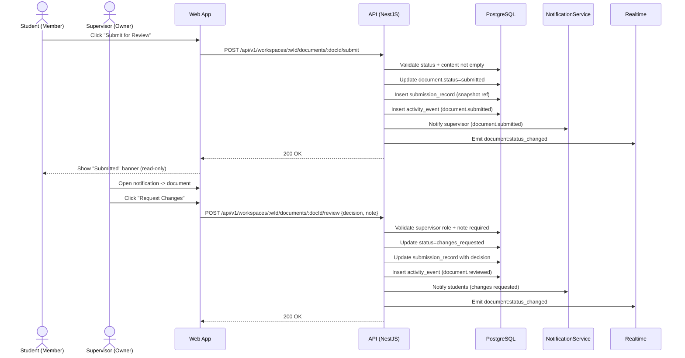

Source: CollabSphere — Ultimate Product & Technical Documentation.md
Sections included: §4.11, §4.11.1, §4.11.10, §4.11.11, §4.11.12, §4.11.13, §4.11.14, §4.11.15, §4.11.2, §4.11.3, §4.11.4, §4.11.5, §4.11.6, §4.11.7, §4.11.8, §4.11.9

# §4.11 FL-010 — Academic Submission & Review Workflow (Academic Mode)

## §4.11.1 Goal

Support an academic workflow where students submit documents for supervisor review, supervisors provide feedback, and documents move through a structured lifecycle:

- Draft → Submitted → (Approved | Changes Requested) → Draft (if changes requested) → Resubmitted → Approved

This flow must:
- lock editing during review (read-only for students)
- preserve review history and decisions
- notify the right people at the right time
- integrate with comments (inline/general) for feedback

> Note: This workflow is enabled only for **Academic workspace type** (or when explicitly enabled in workspace settings).

---

## §4.11.2 Actors

- **Primary:** Student (Member), Project Lead (Manager)
- **Primary:** Supervisor (Owner)
- **Secondary:** Teaching Assistant (Admin)
- **System:** Notification dispatcher, activity logger, access control enforcement

---

## §4.11.3 Preconditions

- Workspace type is `academic` OR `submissionWorkflowEnabled=true`
- User is authenticated and has workspace membership
- Document exists and is not deleted
- Document status is `draft` or `changes_requested` to be eligible for submission
- Document has minimum content threshold (optional but recommended):
  - e.g., non-empty plaintext length >= 50 chars
- Supervisor (Owner) exists for workspace (exactly one owner)

---

## §4.11.4 Postconditions (Success)

### On Submit
- Document status becomes `submitted`
- Document becomes read-only for Member role (students)
- Submission record created (who submitted, when, snapshot pointer)
- Supervisor receives notification
- Activity event logged: `document.submitted`

### On Review Decision
- If approved:
  - status becomes `approved`
  - document remains read-only for students (policy choice; default: read-only)
  - students notified
  - activity event logged
- If changes requested:
  - status becomes `changes_requested`
  - document becomes editable again for students
  - supervisor must provide at least one comment or review note
  - students notified with link to feedback
  - activity event logged

---

## §4.11.5 Document Status Model (Academic Mode)

### Statuses
- `draft`
- `submitted`
- `changes_requested`
- `approved`
- `archived` (Admin/Owner action; read-only)

### Status Transition Rules

| From | To | Actor | Guard | Side Effects |
|------|----|-------|-------|--------------|
| draft | submitted | Member+ | document not empty | lock student editing; notify supervisor; create submission record |
| changes_requested | submitted | Member+ | document not empty | same as above |
| submitted | approved | Owner (Supervisor) | must review | notify students; record decision |
| submitted | changes_requested | Owner (Supervisor) | must include feedback | unlock editing; notify students; record decision |
| approved | draft | Owner/Admin | optional | reopen for edits (rare; explicit action) |
| any | archived | Owner/Admin | — | read-only; hide from active lists (optional) |

---

## §4.11.6 UI/UX — Submitting a Document (Student)

### Location
- Document editor toolbar: “Submit for Review” button
- Visible only when:
  - workspace is academic mode
  - user has edit permission
  - document status in {draft, changes_requested}

### Submit Confirmation Modal
Text:
- “Submit ‘Document Title’ for supervisor review?”
- “After submission, this document will be read-only until the supervisor responds.”

Buttons:
- Cancel
- Submit

Validation:
- If document appears empty:
  - disable submit
  - show message: “Document must contain content before submission.”

After submit:
- Show toast: “Submitted for review”
- Status badge appears in editor header: `Submitted`
- Banner in editor: “This document is under review. Editing is disabled.”

---

## §4.11.7 UI/UX — Review Queue (Supervisor)

Supervisors must have a dedicated view of “Documents awaiting review.”

### Recommended locations
- Workspace Overview page: “Submissions awaiting review” card
- Documents list: filter “Submitted”
- Notifications: clicking “Document submitted” takes them to the document review view

### Review View
Route:
- `/w/:workspaceId/documents/:documentId?mode=review` (optional)

UI:
- Document header shows:
  - Status badge: Submitted
  - Submitted by: user name
  - Submitted at: timestamp
- Document content is viewable; supervisor can add comments
- Review panel (right side or top bar):
  - “Approve” button
  - “Request changes” button
  - Required review notes field (for request changes)
  - Optional summary feedback textarea (for both decisions)

---

## §4.11.8 UI/UX — Supervisor Decision

### A) Approve
- Click “Approve”
- Confirmation modal:
  - “Approve this document?”
  - Optional: “Add a note (optional)”
- Result:
  - Status becomes Approved
  - Students notified

### B) Request Changes
- Click “Request changes”
- Modal requires:
  - Feedback note (min 10 chars)
  - Optionally auto-includes unresolved comments
- Result:
  - Status becomes Changes Requested
  - Students notified
  - Document unlocked for editing

> Requirement: Supervisor must provide feedback when requesting changes. This prevents “changes requested” with no explanation.

---

## §4.11.9 UI/UX — Student Receiving Feedback

When status changes to `changes_requested`, students see:

- Notification:
  - “Changes requested on ‘Document Title’”
  - Includes supervisor note snippet
- Document header:
  - Status badge: Changes Requested
  - Banner: “Supervisor requested changes. Review comments and resubmit.”
- Comments panel:
  - Auto-opens (optional)
  - Shows unresolved comment threads first

---

## §4.11.10 Submission Records & History

To preserve a review audit trail, we store explicit submission records.

### Submission record includes:
- documentId
- workspaceId
- submittedByUserId
- submittedAt
- yjsSnapshotRef (either a copy of Yjs state or pointer to version snapshot)
- decision:
  - approved / changes_requested
- decidedByUserId
- decidedAt
- decisionNote

This enables:
- showing submission history timeline
- version restore to “submitted version” if needed
- future grading workflows

---

## §4.11.11 Sequence Diagram (Mermaid)



---

## §4.11.12 API Contracts (Flow-Level Summary)

### `POST /api/v1/workspaces/:workspaceId/documents/:documentId/submit`

**Auth:** Required  
**Role:** Member+  
**Guard:** Workspace must be academic mode OR workflow enabled  
Request body: empty

Response (200):
```json
{
  "data": {
    "documentId": "uuid",
    "status": "submitted",
    "submittedAt": "2025-07-17T12:00:00Z"
  }
}
```

Errors:
- `400 INVALID_STATUS` (already submitted/approved)
- `400 DOCUMENT_EMPTY`
- `403 FORBIDDEN` (Viewer)
- `404 DOCUMENT_NOT_FOUND`

---

### `POST /api/v1/workspaces/:workspaceId/documents/:documentId/review`

**Auth:** Required  
**Role:** Owner (Supervisor) (or Admin if delegated policy)  

Request:
```json
{
  "decision": "changes_requested",
  "note": "Please add more detail to the methodology section."
}
```

Response (200):
```json
{
  "data": {
    "documentId": "uuid",
    "status": "changes_requested",
    "reviewedAt": "2025-07-17T12:20:00Z",
    "reviewedBy": { "id": "uuid", "fullName": "Dr. Smith" }
  }
}
```

Errors:
- `400 NOTE_REQUIRED` (when changes_requested)
- `400 INVALID_STATUS` (must be submitted)
- `403 FORBIDDEN`
- `404 DOCUMENT_NOT_FOUND`

---

### `GET /api/v1/workspaces/:workspaceId/documents/:documentId/submissions`

Returns submission history.

Response:
```json
{
  "data": {
    "items": [
      {
        "id": "sub-uuid",
        "submittedBy": { "id": "u1", "fullName": "Alice" },
        "submittedAt": "2025-07-10T10:00:00Z",
        "decision": "changes_requested",
        "decidedBy": { "id": "u2", "fullName": "Dr. Smith" },
        "decidedAt": "2025-07-10T12:00:00Z",
        "note": "Please add citations.",
        "snapshotVersionId": "ver-uuid"
      }
    ]
  }
}
```

---

## §4.11.13 Events Emitted

| Event | Trigger | Payload |
|-------|---------|---------|
| `document.submitted` | submit endpoint | `{ workspaceId, documentId, submittedBy }` |
| `document.reviewed` | supervisor decision | `{ workspaceId, documentId, decision, decidedBy }` |
| `document.status_changed` | any status change | `{ documentId, from, to }` |
| `notification.document_submitted` | notify supervisor | `{ supervisorId, documentId }` |
| `notification.document_review_decision` | notify students | `{ workspaceId, documentId, decision }` |

---

## §4.11.14 Edge Cases

| Edge Case | Expected Behavior |
|----------|-------------------|
| No supervisor/owner assigned | Submission blocked with error `400 NO_SUPERVISOR_ASSIGNED`. UI suggests contacting admin/owner. (But in our model, workspace always has an owner.) |
| Student tries to edit while submitted | Client disables editing; server rejects any CRDT updates for that user. |
| Supervisor requests changes with no comments/notes | API rejects with `400 NOTE_REQUIRED`. |
| Multiple submissions in short time | Allow resubmit only when status is draft/changes_requested. |
| Supervisor tries to approve a draft | API rejects `400 INVALID_STATUS`. |
| Member role changed during review | Authorization re-checked on each action; status rules still apply. |
| Document deleted while submitted | Disallow deletion while submitted/approved. |
| Students want to export submitted doc | Allow export in submitted/approved states if permissions allow. |

---

## §4.11.15 Observability

Metrics:
- `document.submissions.count`
- `document.review.decisions.count` (labels: decision)
- `document.review.time_to_decision_hours` (histogram)
- `document.submission.blocked.count` (labels: reason)

Logs:
- `document_submitted` (info)
- `document_reviewed` (info)
- `document_submit_denied` (warn)
- `document_review_denied` (warn)
- `document_status_transition_invalid` (warn)

---

