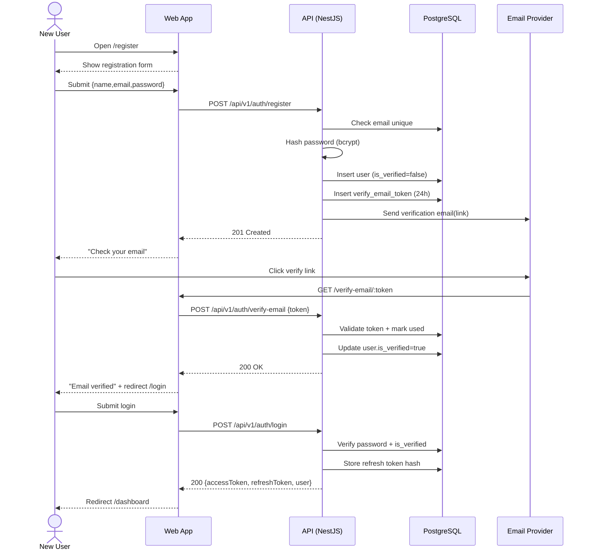

Source: CollabSphere — Ultimate Product & Technical Documentation.md
Sections included: §4.2, §4.2.1, §4.2.10, §4.2.2, §4.2.3, §4.2.4, §4.2.5, §4.2.6, §4.2.7, §4.2.8, §4.2.9

## §4.2 FL-001 — User Onboarding (Register → Verify Email → Login)

### §4.2.1 Goal

Enable a new user to create an account, verify their email, and log into CollabSphere successfully, landing in a functional dashboard.

### §4.2.2 Actors

- **Primary:** New User (Student/Developer/etc.)
- **Secondary:** System (Email service, token issuer)
- **Optional:** Platform Admin (not part of the flow)

### §4.2.3 Preconditions

- User has access to their email inbox
- CollabSphere backend is reachable
- Email sending provider is configured (e.g., Resend/SendGrid)
- No existing account already uses the same email

### §4.2.4 Postconditions (Success)

- User account exists in `users` table
- `users.is_verified = true`
- User has valid session (access token + refresh token)
- User is redirected to `/dashboard`
- User sees dashboard empty states if they have no workspaces
- Audit log/event history contains a record of registration + email verification + login

### §4.2.5 User Journey (Step-by-Step)

#### Step 1 — User opens Register page
- Route: `/register`
- UI:
  - Fields: Full name, Email, Password, Confirm password
  - Optional: “Continue with Google” button (FL-002)
  - Checkbox: Terms acceptance (v1 optional; if included, must be stored)

#### Step 2 — Client-side validation
- Enforce:
  - Email format
  - Password policy (min 8 chars + uppercase + lowercase + number + special)
  - Confirm password matches
- UX:
  - Inline errors per field
  - Submit button disabled until valid

#### Step 3 — Submit registration
- Client calls:
  - `POST /api/v1/auth/register`
- Server:
  - Validates request (Zod/class-validator)
  - Checks for duplicate email (case-insensitive)
  - Hashes password (bcrypt, cost 12)
  - Creates user with:
    - `is_verified = false`
    - `is_active = true`
    - `auth_provider = "local"`
  - Creates email verification token (expiry: 24h)
  - Sends verification email

#### Step 4 — Register confirmation screen
- UI shows:
  - “Check your email to verify your account”
  - Button: “Resend verification email”
  - Link: “Back to Login”

#### Step 5 — User clicks verification link in email
- Link target:
  - `GET /verify-email/:token` (frontend route)
- Frontend calls:
  - `POST /api/v1/auth/verify-email` with token

#### Step 6 — Email verified
- Server:
  - Validates token (exists, not expired, not used)
  - Sets `users.is_verified = true`
  - Marks token as used
- UI:
  - Success message: “Email verified”
  - CTA: “Continue to login”
  - Optionally auto-redirect to `/login`

#### Step 7 — User logs in
- Route: `/login`
- Client calls:
  - `POST /api/v1/auth/login`
- Server:
  - Validates credentials
  - Verifies `is_verified == true`
  - Issues:
    - Access token (JWT, 15m expiry)
    - Refresh token (opaque, stored hashed in DB, 7d expiry)
- UI:
  - Redirect to `/dashboard`

---

### §4.2.6 Sequence Diagram (Mermaid)



---

### §4.2.7 API Contracts (Flow-Level Summary)

#### `POST /api/v1/auth/register`

Request:
```json
{
  "fullName": "Jane Doe",
  "email": "jane@example.com",
  "password": "StrongPass@123"
}
```

Response (201):
```json
{
  "data": {
    "message": "Registration successful. Please verify your email."
  }
}
```

Errors:
- `400 VALIDATION_ERROR` (weak password, invalid email)
- `409 EMAIL_ALREADY_EXISTS`
- `429 RATE_LIMITED` (per IP/email)

#### `POST /api/v1/auth/verify-email`

Request:
```json
{
  "token": "verify_token_here"
}
```

Response (200):
```json
{
  "data": {
    "message": "Email verified successfully."
  }
}
```

Errors:
- `400 TOKEN_INVALID`
- `410 TOKEN_EXPIRED`
- `400 TOKEN_ALREADY_USED`

#### `POST /api/v1/auth/login`

Request:
```json
{
  "email": "jane@example.com",
  "password": "StrongPass@123"
}
```

Response (200):
```json
{
  "data": {
    "accessToken": "jwt...",
    "refreshToken": "opaque...",
    "user": {
      "id": "uuid",
      "email": "jane@example.com",
      "fullName": "Jane Doe",
      "isVerified": true,
      "globalRole": "USER"
    }
  }
}
```

Errors:
- `400 INVALID_CREDENTIALS`
- `403 EMAIL_NOT_VERIFIED`
- `403 ACCOUNT_DEACTIVATED`

---

### §4.2.8 Events Emitted (Internal Event Bus)

| Event | Trigger | Payload |
|-------|---------|---------|
| `user.registered` | Successful register | `{ userId, email }` |
| `user.verification_sent` | Verification email dispatched | `{ userId, email, tokenId }` |
| `user.email_verified` | Token verified | `{ userId, email }` |
| `user.logged_in` | Successful login | `{ userId, ip, userAgent }` |
| `security.login_failed` | Login failure | `{ email, ip, reason }` |

These events feed:
- Activity feed (where applicable)
- Audit log (security-critical events)
- Email sending and retry worker
- Observability metrics

---

### §4.2.9 Edge Cases (Must Be Handled)

| Edge Case | Expected Behavior |
|----------|-------------------|
| Email already registered | Return `409 EMAIL_ALREADY_EXISTS`. UI: inline error under email field. |
| Email differs only by case (`Jane@x.com` vs `jane@x.com`) | Treat as duplicate. Store emails normalized (lowercase). |
| Password weak | Return `400 VALIDATION_ERROR` with explicit rules. UI shows which requirement failed. |
| User tries to login before verifying email | Return `403 EMAIL_NOT_VERIFIED`. UI offers “Resend verification email”. |
| Verification link expired | Return `410 TOKEN_EXPIRED`. UI shows “Resend verification email” CTA. |
| Verification link reused | Return `400 TOKEN_ALREADY_USED`. UI shows “Already verified — go to login”. |
| Email provider fails to send | Registration still succeeds. UI warns: “We couldn’t send email. Try resend.” Background retry via worker. |
| User refreshes “check your email” page | No duplicate accounts created. Register endpoint should be idempotent per email within short window (optional). |
| Rate limiting triggered | Return `429 RATE_LIMITED`. UI disables submit temporarily with countdown. |

---

### §4.2.10 Security & Privacy Notes (Flow-Specific)

- Passwords must be **hashed** (bcrypt/argon2), never encrypted.
- Verification tokens are **single-use** and stored hashed in DB (or stored as random opaque token with hashed lookup).
- Login responses must not reveal whether an email exists (optional hardening). If implemented, errors should be generic: “Invalid credentials” while audit logs store the true reason.
- All auth endpoints must have rate limiting:
  - Register: 5/hour per IP + 5/hour per email
  - Login: 10/min per IP
  - Verify: 30/min per IP
- All auth responses include `requestId` for debugging (no stack traces).

---

