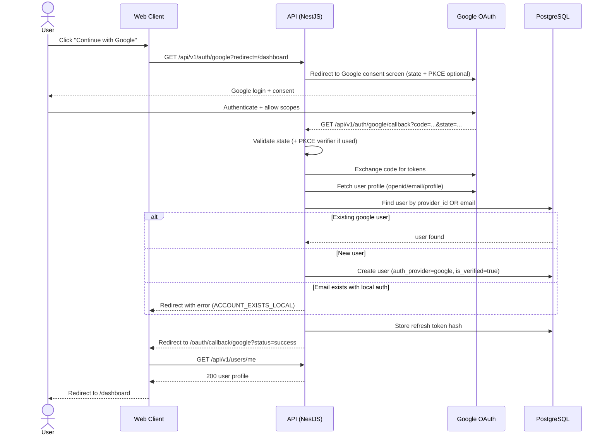

Source: CollabSphere — Ultimate Product & Technical Documentation.md
Sections included: §4.3, §4.3.1, §4.3.10, §4.3.11, §4.3.12, §4.3.2, §4.3.3, §4.3.4, §4.3.5, §4.3.6, §4.3.7, §4.3.8, §4.3.9

# §4.3 FL-002 — OAuth Onboarding (Google Login)

## §4.3.1 Goal

Allow a user to sign in (or sign up) using their Google account via OAuth 2.0, without creating or managing a CollabSphere password.

This flow must support:
- First-time OAuth users (new account creation)
- Returning OAuth users (login)
- Workspace invitation acceptance for OAuth users (if they clicked an invite link first)

---

## §4.3.2 Actors

- **Primary:** User (Student/Developer/etc.)
- **Secondary:** Google OAuth Provider
- **System:** CollabSphere Auth Service (token issuance, user provisioning)

---

## §4.3.3 Preconditions

- Google OAuth app is configured with:
  - Authorized redirect URIs (staging + production)
  - Client ID and Client Secret stored as secrets
- CollabSphere knows its own base URL (for redirects)
- User has a Google account and can authenticate with Google

---

## §4.3.4 Postconditions (Success)

- User exists in `users` table with:
  - `auth_provider = "google"`
  - `auth_provider_id = <google subject id>`
  - `is_verified = true` (OAuth provider verification assumed)
- User has active session:
  - Access token (JWT, 15m)
  - Refresh token (opaque, 7d) stored securely
- User lands on:
  - `/dashboard` (default), OR
  - Workspace route if they came from an invite link (see edge cases)

---

## §4.3.5 OAuth Model & Security Requirements

### OAuth Mode (v1)

CollabSphere uses **OAuth 2.0 Authorization Code flow**.

- If the frontend is a static web client and the backend is NestJS:
  - The backend initiates OAuth and handles the callback using Passport strategy
  - The frontend receives the final session via redirect to an app route

### Required Security Controls

| Control | Required | Notes |
|--------|----------|------|
| `state` parameter | ✅ | Prevents CSRF on OAuth callback |
| PKCE | ✅ (recommended) | If feasible, implement PKCE for stronger security |
| Redirect URI allowlist | ✅ | Must be configured server-side; never accept arbitrary redirect URLs |
| Minimal scopes | ✅ | Use only `openid email profile` |
| Account takeover prevention | ✅ | If email exists under local auth, do not silently merge (see edge cases) |
| Secure token storage | ✅ | Refresh tokens must be `httpOnly` cookies or stored hashed server-side |
| Audit logging | ✅ | Log successful and failed OAuth attempts |

---

## §4.3.6 User Journey (Step-by-Step)

### Step 1 — User clicks “Continue with Google”
Locations:
- `/login`
- `/register`
- `/invite/:token` (if user not logged in)

UI behavior:
- Immediately redirect to Google sign-in (no intermediate page unless popup is used)

### Step 2 — Frontend starts OAuth
Two acceptable implementations:

#### Option A (recommended): Backend-initiated redirect
- Browser navigates to:
  - `GET /api/v1/auth/google?redirect=/dashboard`
- Backend redirects to Google OAuth consent page

#### Option B: Frontend uses Google SDK (not recommended for v1)
- Adds complexity and increases security surface area

**We will use Option A in v1.**

### Step 3 — User authenticates with Google
- Google prompts user to choose account (if multiple)
- User grants permission (if first time)

### Step 4 — Google redirects to backend callback
- Google redirects to:
  - `GET /api/v1/auth/google/callback?code=...&state=...`

Backend:
- Validates `state`
- Exchanges `code` for tokens with Google
- Retrieves profile info:
  - `sub` (Google user id)
  - `email`
  - `name`, `given_name`, `family_name`
  - `picture`

### Step 5 — CollabSphere user provisioning / login decision
Backend logic:

1. Look up user by `auth_provider = google` and `auth_provider_id = sub`
   - If found → returning user login
2. Else look up by email
   - If NOT found → create new user (OAuth signup)
   - If found but `auth_provider != google` → **do not auto-link** (see edge cases)

### Step 6 — Session issuance
- Issue JWT access token (15m)
- Issue refresh token (7d)
- Store refresh token hash in DB (or session table)
- Set refresh token in a **secure cookie** (recommended)

Cookie settings:
- `httpOnly: true`
- `secure: true` in production
- `sameSite: "lax"` (or `"strict"` if feasible)
- `path: /api/v1/auth/refresh` (recommended narrow scope)

### Step 7 — Redirect to frontend
Backend redirects to:
- `/oauth/callback/google?status=success`

Frontend callback page:
- Fetches `/api/v1/users/me` (or reads user payload embedded safely)
- Stores access token in memory (or secure storage strategy)
- Redirects to:
  - `/dashboard` by default
  - or the invite target workspace if invite context exists

---

## §4.3.7 Sequence Diagram (Mermaid)



---

## §4.3.8 API Contracts (Flow-Level Summary)

### `GET /api/v1/auth/google`

**Description:** Starts Google OAuth login.  
**Auth:** Not required.  
**Query params:**
- `redirect` (string, optional): Relative path to redirect after login. Must be allowlisted (e.g., `/dashboard`, `/workspaces`, `/w/:id`).

**Response:**
- `302 Redirect` to Google OAuth authorization URL

---

### `GET /api/v1/auth/google/callback`

**Description:** OAuth callback handler.  
**Auth:** Not required (Google authenticates).  
**Response:**
- `302 Redirect` to frontend route with success or error status

Possible redirect examples:
- Success: `/oauth/callback/google?status=success`
- Error: `/oauth/callback/google?status=error&code=ACCOUNT_EXISTS_LOCAL`

---

### `GET /api/v1/users/me` (post-login verification)

**Description:** Returns current authenticated user profile.  
**Auth:** Required.

Response (200):
```json
{
  "data": {
    "id": "uuid",
    "email": "jane@example.com",
    "fullName": "Jane Doe",
    "avatarUrl": "https://...",
    "isVerified": true,
    "globalRole": "USER",
    "authProvider": "google"
  }
}
```

Errors:
- `401 UNAUTHORIZED` (session not established properly)

---

## §4.3.9 Events Emitted (Internal Event Bus)

| Event | Trigger | Payload |
|-------|---------|---------|
| `auth.oauth_started` | User initiates OAuth | `{ provider: "google", ip }` |
| `auth.oauth_callback_received` | Callback hit | `{ provider: "google", ip }` |
| `user.created_via_oauth` | New user provisioned | `{ userId, email, provider: "google" }` |
| `user.logged_in_via_oauth` | Successful OAuth login | `{ userId, provider: "google", ip, userAgent }` |
| `security.oauth_failed` | OAuth failure | `{ provider: "google", reason, ip }` |

---

## §4.3.10 Edge Cases (Must Be Handled)

| Edge Case | Expected Behavior |
|----------|-------------------|
| User cancels at Google consent | Redirect to `/login` with message “Google sign-in was cancelled.” |
| Google callback missing `code` | Redirect with error `OAUTH_INVALID_CALLBACK`. Log as `security.oauth_failed`. |
| State mismatch (CSRF attempt) | Hard fail. Redirect with error `OAUTH_STATE_MISMATCH`. Log critical security event. |
| Email exists with local auth account | Do **not** auto-link. Redirect with error `ACCOUNT_EXISTS_LOCAL` and message: “An account with this email already exists. Please sign in using email/password.” (Account linking can be v1.1 feature). |
| Email exists with different provider (future: GitHub) | Do not auto-link. Redirect with error `ACCOUNT_EXISTS_OTHER_PROVIDER`. |
| User starts OAuth from invite link | After successful login, redirect to `/invite/:token` continuation flow to join workspace. |
| Refresh token cookie blocked (strict browser settings) | Fallback to storing refresh token in secure storage (v1 acceptable) OR show message: “Cookies required for session persistence.” |
| Google API temporarily unavailable | Redirect with error `OAUTH_PROVIDER_UNAVAILABLE`. Suggest retry. |
| User changes Google email (rare) | Match by provider `sub` first. Email is not the primary key for OAuth identity. |

---

## §4.3.11 UX Requirements

- Login/Register page must show Google button with Google brand guidelines
- OAuth callback route must show:
  - Loading state: “Signing you in…”
  - Success state: “Signed in — redirecting…”
  - Error state with human-friendly message + next action button
- If OAuth fails, the UI must never show raw error payloads or stack traces
- Always provide a retry CTA on transient errors

---

## §4.3.12 Observability (Flow-Specific)

Required logs (structured):
- `oauth_start` (info): provider, ip, requestId
- `oauth_callback` (info): provider, ip, requestId
- `oauth_user_created` (info): userId, provider
- `oauth_login_success` (info): userId, provider
- `oauth_login_failed` (warn/error): reason, provider, ip

Metrics:
- OAuth login success rate by provider
- OAuth callback latency (p95)
- OAuth failure reasons frequency (to detect misconfig or attacks)

---

