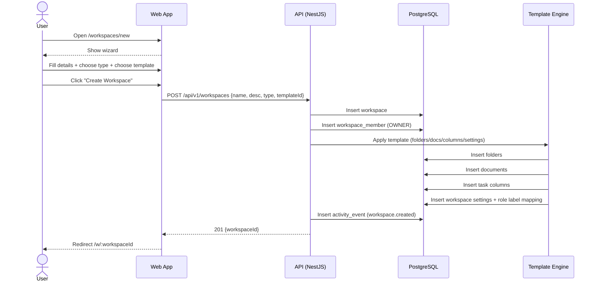

Source: CollabSphere — Ultimate Product & Technical Documentation.md
Sections included: §4.4, §4.4.1, §4.4.10, §4.4.11, §4.4.2, §4.4.3, §4.4.4, §4.4.5, §4.4.6, §4.4.7, §4.4.8, §4.4.9

# §4.4 FL-003 — Workspace Creation (Type + Template)

## §4.4.1 Goal

Enable an authenticated user to create a new workspace by selecting:
1) a **workspace type** (Professional / Academic / General), and  
2) a **workspace template** (pre-built structure),  
resulting in a fully initialized workspace with documents, folders, task board columns, and default settings.

This flow is a core differentiator of CollabSphere and must be fast, guided, and error-proof.

---

## §4.4.2 Actors

- **Primary:** User (Project Lead, Supervisor, Engineering Manager, Developer)
- **Secondary:** System (Template engine, Workspace initializer, Notification dispatcher)
- **Optional:** Invitees (not part of creation flow, but follow immediately after)

---

## §4.4.3 Preconditions

- User is authenticated
- User has not exceeded workspace limits (v1 default: max 20 workspaces/user; configurable)
- Built-in templates exist in the system
- The system can write to the database successfully

---

## §4.4.4 Postconditions (Success)

- A `workspaces` record exists with:
  - `type`: `professional` or `academic` or `general`
  - `owner_id`: current user
- A `workspace_members` record exists making the creator the `OWNER`
- Workspace content is initialized from the template:
  - Folder/document hierarchy created
  - Task board columns created
  - Default workspace settings applied
- Workspace becomes accessible at `/w/:workspaceId`
- Activity event logged: `workspace.created`
- Notification optionally dispatched to creator: “Workspace created successfully” (in-app toast, not necessarily persistent)

---

## §4.4.5 UI/UX — Workspace Creation Wizard

### Route
- `/workspaces/new`

### Wizard Steps (v1)

**Step 1 — Workspace Details**
- Fields:
  - Workspace name (required, 3–60 chars)
  - Description/summary (optional, max 280 chars)
  - Icon (optional: emoji/icon selector)
- Validation:
  - Name required
  - Name unique per owner (optional, recommended) OR allow duplicates globally but display warnings
- UX:
  - Live character count
  - If name duplicates an existing workspace under same owner, show warning: “You already have a workspace with this name.”

**Step 2 — Select Workspace Type**
- Options:
  - **Professional**: “For software teams, product development, client work”
  - **Academic**: “For student projects, supervisor review workflows, academic templates”
  - **General**: “A blank workspace with minimal structure”
- UX:
  - Card selection UI with short description and preview of included features
  - Type affects:
    - visible role labels (see §2.4)
    - default template library grouping
    - enabled workflows (Academic submission/review)

**Step 3 — Select Template**
- Template list filtered by selected workspace type
- Template cards show:
  - Template name
  - Category badge (Academic / Professional / General)
  - Short description (1–2 lines)
  - Preview button (opens modal)
  - “Use this template” button
- Required selection:
  - Professional/Academic: must choose a template
  - General: can choose “Blank Workspace” template by default

**Step 4 — Review & Create**
- Summary:
  - Name, type, template
  - List of what will be created:
    - Documents count
    - Folders count
    - Task columns
- Create button:
  - “Create Workspace”
- UX:
  - On click, show loading state: “Creating workspace…”
  - Disable button to prevent duplicates
  - On success: redirect to workspace home
  - On error: show error state with Retry

### Optional Step (P1): Invite Team Immediately
After creation succeeds, show modal:
- “Invite teammates now?”
- Email input (multi-entry)
- Role selector (default based on workspace type)
- Skip button

This can be included in v1 if time permits; otherwise v1.1.

---

## §4.4.6 Template Application Rules

When a template is applied, the system must create:

1) Workspace settings (type-specific defaults)  
2) Role label mapping (type-specific labels)  
3) Default navigation layout (which sidebar sections appear)  
4) Folder tree + documents (with seeded content)  
5) Task board columns (and optionally starter tasks)  

### Example: Academic “Senior Project” Template creates:

- Workspace folders:
  - “Proposal”
  - “Requirements”
  - “Design”
  - “Implementation”
  - “Testing”
  - “Final Report”
  - “Meeting Minutes”
- Documents:
  - Proposal document (with placeholders)
  - RAD / SRS document (with headings)
  - Architecture design document
  - Weekly progress report template
- Task board:
  - Columns: Backlog, To Do, In Progress, Review, Done
- Settings:
  - Academic submission workflow enabled
  - Supervisor role label mapping enabled
  - Export defaults: PDF enabled for everyone, Markdown enabled for Member+

### Example: Professional “Software Development Project” Template creates:

- Workspace folders:
  - “Product”
  - “Architecture”
  - “Engineering”
  - “Meetings”
  - “Releases”
- Documents:
  - PRD template
  - RFC template
  - ADR log
  - Sprint retrospective template
- Task board:
  - Columns: Backlog, Sprint, In Progress, Review, Done
- Settings:
  - Academic workflow disabled
  - Default task statuses map to dev lifecycle

---

## §4.4.7 Sequence Diagram (Mermaid)



---

## §4.4.8 API Contracts (Flow-Level Summary)

### `POST /api/v1/workspaces`

**Auth:** Required  
**Minimum role:** Any authenticated user  
**Rate limit:** 10/min per user  

Request:
```json
{
  "name": "Senior Project — Group Alpha",
  "description": "Building a unified project workspace platform.",
  "type": "academic",
  "templateId": "tpl_academic_senior_project_v1",
  "icon": "📦"
}
```

Response (201):
```json
{
  "data": {
    "workspace": {
      "id": "uuid",
      "name": "Senior Project — Group Alpha",
      "description": "Building a unified project workspace platform.",
      "type": "academic",
      "icon": "📦",
      "createdAt": "2025-07-17T12:00:00Z"
    }
  }
}
```

Errors:
- `400 VALIDATION_ERROR` (name length, invalid type)
- `404 TEMPLATE_NOT_FOUND`
- `409 WORKSPACE_NAME_CONFLICT` (if enforced per owner)
- `403 WORKSPACE_LIMIT_REACHED`
- `500 INTERNAL_ERROR`

---

## §4.4.9 Events Emitted

| Event | Trigger | Payload |
|-------|---------|---------|
| `workspace.created` | Workspace created | `{ workspaceId, ownerId, type, templateId }` |
| `workspace.template_applied` | Template applied successfully | `{ workspaceId, templateId, createdCounts }` |
| `activity.workspace_created` | Activity feed entry | `{ workspaceId, actorId }` |

---

## §4.4.10 Edge Cases

| Edge Case | Expected Behavior |
|----------|-------------------|
| Duplicate workspace name (same owner) | If uniqueness enforced: 409 conflict with suggestion. If not enforced: allow but show UI warning. |
| Template missing/disabled | Return 404 TEMPLATE_NOT_FOUND. UI: show error and return to template selection. |
| Partial template application failure | Entire operation must be transactional. If any insert fails, rollback workspace creation and return 500. |
| User spams create button | Button disabled + server idempotency key recommended (`X-Idempotency-Key`). |
| Workspace limit reached | Return 403 WORKSPACE_LIMIT_REACHED. UI suggests archiving or deleting an old workspace. |
| User chooses Academic type but Professional template | Not allowed. Template list must be filtered by type and backend must validate template category matches workspace type. |
| Name with illegal characters | Allow most Unicode, but disallow control characters. Normalize whitespace. |
| Network drop after create | If idempotency key used, retry returns same workspace. Otherwise user might create duplicates—mitigate with client-generated idempotency key. |

---

## §4.4.11 Data Model Implications (Created Records)

On success, the following records are created (minimum):

- `workspaces` (1 row)
- `workspace_members` (1 row: owner membership)
- `workspace_settings` (1 row)
- `workspace_role_labels` (1 row or embedded in settings JSON)
- `folders` (N rows)
- `documents` (N rows)
- `task_columns` (N rows)
- `activity_events` (1+ rows)

---

