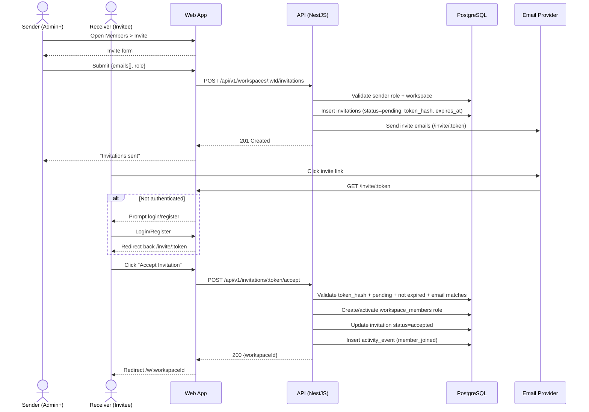

Source: CollabSphere — Ultimate Product & Technical Documentation.md
Sections included: §4.5, §4.5.1, §4.5.10, §4.5.11, §4.5.12, §4.5.2, §4.5.3, §4.5.4, §4.5.5, §4.5.6, §4.5.7, §4.5.8, §4.5.9

# §4.5 FL-004 — Workspace Invitation (Invite → Accept → Join)

## §4.5.1 Goal

Enable workspace Admin+ users to invite new members by email, and enable invitees (existing or new users) to accept the invitation and join the workspace with the assigned role.

The flow must support:
- Inviting an email that already has an account
- Inviting an email without an account (invite-first registration)
- Invitation expiration and re-invites
- Role assignment at invite time
- Workspace scoping and security (no token guessing)

---

## §4.5.2 Actors

- **Primary (Sender):** Workspace Owner/Admin (and Manager where allowed by policy)
- **Primary (Receiver):** Invitee (any persona)
- **System:** Email service, Invitation service, RBAC guard, Workspace membership service

---

## §4.5.3 Preconditions

- Sender is authenticated
- Sender is a member of the workspace
- Sender has permission to invite members:
  - Owner: can invite any role
  - Admin: can invite up to Manager
  - Manager: can invite up to Member (optional v1; can be Admin+ only if you want stricter)
- Workspace exists and is not deleted
- Email provider configured (for email invites)
- Invitee email address is syntactically valid

---

## §4.5.4 Postconditions (Success)

- An invitation record exists in DB with:
  - `workspace_id`
  - `invited_email`
  - `role_to_assign`
  - `token_hash`
  - `status = pending`
  - `expires_at = now + 7 days`
- Invitee receives email with invite link:
  - `/invite/:token`
- On acceptance:
  - A `workspace_members` record is created or activated
  - Invitation status becomes `accepted`
  - Activity event logged: `workspace.member_joined`
  - Notifications dispatched:
    - Sender is notified “X joined the workspace”
    - Invitee is notified “You joined workspace Y”

---

## §4.5.5 UX — Invite Member

### Location(s)
- Workspace sidebar: **Members**
- Workspace settings: **Member Management**
- Optional quick action in top bar: “Invite”

### UI Components
- Email input with multi-entry support:
  - Allows input like: `alice@x.com, bob@y.com`
- Role selector dropdown (based on sender’s max assignable role)
- Optional message text area (P2)
- “Send Invitations” button
- Pending invitations list (shows email, role, invitedBy, createdAt, expiresAt, status)

### UX Rules
- Inline validation for each email
- If email belongs to existing user, still send invite email (and also create in-app notification)
- Invitations are sent in background; show progress if multiple emails
- If any invite fails, show which email failed and why

---

## §4.5.6 UX — Accept Invitation

### Entry Point
Invite link received via email:

`https://collabsphere.io/invite/<token>`

### Page: AcceptInvitePage (`/invite/:token`)

#### If user is NOT authenticated:
- Show:
  - “You’ve been invited to join [Workspace Name]”
  - Buttons:
    - “Sign in to accept”
    - “Create account to accept” (prefills email if possible)
    - “Continue with Google”
- After login/register, redirect back to `/invite/:token`

#### If user IS authenticated:
- Show:
  - Workspace name + description
  - Role they will have (label + permissions summary)
  - “Accept Invitation” button
  - “Decline” link (optional v1.1)

On accept:
- Call `POST /api/v1/invitations/:token/accept`
- Redirect to `/w/:workspaceId`

---

## §4.5.7 Invitation Token & Security Design

### Token format
- Token is a random 32–64 byte secure value, base64url-encoded
- Token is **never stored in plaintext** in DB; store only `token_hash = sha256(token)`
- Invite link includes plaintext token, but database lookup uses hash

### Expiry
- Default expiry: 7 days
- Expired invites cannot be accepted
- Admin+ can resend invite (creates new token, invalidates old)

### Abuse Prevention
- Rate limit invite sending:
  - 30 invites/day per workspace
  - 10 invites/min per sender
- Prevent user enumeration:
  - Invites should not reveal whether email is registered in API response; UI can show “Invitation sent” regardless

### Workspace Scoping
- Invitation acceptance must validate:
  - Token matches invitation record
  - Invitation status = pending
  - Not expired
  - Workspace exists and is active
  - Email match:
    - If invitation is tied to email, the logged-in user must have the same email
    - Exception (optional): allow Owner to generate “link invite” not email-bound (v2)

---

## §4.5.8 Sequence Diagram (Mermaid)



---

## §4.5.9 API Contracts (Flow-Level Summary)

### `POST /api/v1/workspaces/:workspaceId/invitations`

**Auth:** Required  
**Workspace role required:** Admin+ (or Manager+ if allowed)  
**Rate limit:** 10/min per sender, 30/day per workspace  

Request:
```json
{
  "emails": ["alice@example.com", "bob@example.com"],
  "role": "MEMBER"
}
```

Response (201):
```json
{
  "data": {
    "invitations": [
      {
        "id": "uuid",
        "email": "alice@example.com",
        "role": "MEMBER",
        "status": "pending",
        "expiresAt": "2025-07-24T12:00:00Z"
      }
    ]
  }
}
```

Errors:
- `400 VALIDATION_ERROR` (invalid email, invalid role)
- `403 FORBIDDEN` (insufficient workspace role)
- `404 WORKSPACE_NOT_FOUND`
- `429 RATE_LIMITED`

---

### `GET /api/v1/invitations/:token` (invite preview)

**Auth:** Optional  
**Description:** Returns invitation metadata so UI can show workspace name and role before accepting.

Response (200):
```json
{
  "data": {
    "invitation": {
      "status": "pending",
      "expiresAt": "2025-07-24T12:00:00Z",
      "workspace": {
        "id": "uuid",
        "name": "Project Alpha",
        "description": "Building X"
      },
      "role": "MEMBER",
      "invitedEmail": "alice@example.com"
    }
  }
}
```

Errors:
- `404 INVITATION_NOT_FOUND`
- `410 INVITATION_EXPIRED`
- `400 INVITATION_ALREADY_USED`

---

### `POST /api/v1/invitations/:token/accept`

**Auth:** Required  
**Description:** Accept invitation and join workspace.

Response (200):
```json
{
  "data": {
    "workspaceId": "uuid",
    "membership": {
      "role": "MEMBER",
      "joinedAt": "2025-07-17T12:10:00Z"
    }
  }
}
```

Errors:
- `401 UNAUTHORIZED`
- `403 EMAIL_MISMATCH` (logged-in user email differs from invited email)
- `404 INVITATION_NOT_FOUND`
- `410 INVITATION_EXPIRED`
- `400 INVITATION_ALREADY_USED`
- `404 WORKSPACE_NOT_FOUND`

---

### `POST /api/v1/workspaces/:workspaceId/invitations/:invitationId/resend` (Admin+)

**Auth:** Required  
**Role:** Admin+  
**Behavior:** Invalidates old token, issues new token, sends email again.

Errors:
- `403 FORBIDDEN`
- `404 INVITATION_NOT_FOUND`

---

## §4.5.10 Events Emitted

| Event | Trigger | Payload |
|-------|---------|---------|
| `workspace.invitation_created` | Invite created | `{ workspaceId, invitationId, invitedEmail, role, inviterId }` |
| `workspace.invitation_resent` | Invite resent | `{ workspaceId, invitationId, inviterId }` |
| `workspace.invitation_accepted` | Invite accepted | `{ workspaceId, invitationId, userId, role }` |
| `workspace.member_joined` | Membership created | `{ workspaceId, userId, role }` |
| `notification.sent` | Invite email sent | `{ toEmail, template: "workspace_invite" }` |

---

## §4.5.11 Edge Cases

| Edge Case | Expected Behavior |
|----------|-------------------|
| Invitee already a member | Accept endpoint returns `400 ALREADY_MEMBER` and redirects user to workspace. |
| Multiple pending invites for same email/workspace | New invite invalidates old pending invite OR keep latest only (recommended). |
| Invitee changes email after invitation | If email mismatch occurs, reject with `403 EMAIL_MISMATCH` and show support message. |
| Workspace deleted after invite | Accept endpoint returns `404 WORKSPACE_NOT_FOUND`. UI shows “Workspace no longer exists.” |
| Invite expired | `410 INVITATION_EXPIRED` with CTA: “Request a new invite.” |
| Invite token guessed/bruteforced | Rate-limit token endpoints + token entropy high enough to make guessing infeasible. |
| Sender tries to invite with higher role than allowed | `403 FORBIDDEN_ROLE_ASSIGNMENT`. UI prevents selecting disallowed roles. |
| Email delivery fails | Invitation still created; resend available. Background retries via worker. |

---

## §4.5.12 Data Model Implications

Minimum tables involved:
- `invitations`
- `workspaces`
- `workspace_members`
- `users`
- `activity_events`
- `notifications` (optional for in-app invite notifications)

Key columns for `invitations`:
- `id` (UUID)
- `workspace_id` (UUID)
- `invited_email` (varchar)
- `role` (enum)
- `token_hash` (char(64) sha256)
- `status` (pending/accepted/expired/revoked)
- `invited_by_user_id` (UUID)
- `expires_at` (timestamp)
- `accepted_by_user_id` (UUID nullable)
- `accepted_at` (timestamp nullable)
- `created_at`, `updated_at`

---

