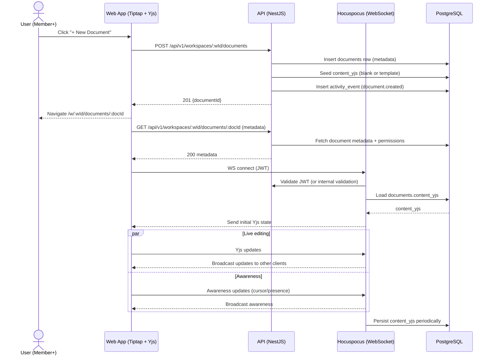

Source: CollabSphere — Ultimate Product & Technical Documentation.md
Sections included: §4.6, §4.6.1, §4.6.10, §4.6.11, §4.6.12, §4.6.13, §4.6.2, §4.6.3, §4.6.4, §4.6.5, §4.6.6, §4.6.7, §4.6.8, §4.6.9

# §4.6 FL-005 — Document Creation + Real-Time Collaboration (Tiptap + Yjs + Hocuspocus)

## §4.6.1 Goal

Enable workspace members to:
1) create documents (optionally from templates) inside a workspace folder hierarchy, and  
2) collaborate on the same document in real-time with presence and cursor indicators,  
without data loss—even with network latency or temporary disconnects.

This is the flagship capability of CollabSphere.

---

## §4.6.2 Actors

- **Primary:** Member+ (Student, Developer), Manager+, Admin+, Owner
- **Secondary:** Viewer (read-only access)
- **System:** Document service, Template service, Hocuspocus collaboration server, Storage/persistence layer

---

## §4.6.3 Preconditions

- User is authenticated
- User is a workspace member
- Document permissions allow creation/editing:
  - Create: Member+
  - Edit: per RBAC and document state (locked/submitted/archived)
- Collaboration service is reachable via WebSocket
- Database is reachable for persistence

---

## §4.6.4 Postconditions (Success)

### After Document Creation
- A `documents` row exists linked to workspace and (optional) folder
- Document contains initial seeded content:
  - Blank doc (default), or
  - Template-seeded doc content
- Activity event logged: `document.created`

### After Collaboration Session
- User sees:
  - Real-time updates from other editors within <500ms under normal conditions
  - Presence avatars of active editors
  - Collaborative cursors (P1)
- Document state is persisted periodically
- Activity events logged for meaningful changes (coalesced; not per keystroke)

---

## §4.6.5 Document Model: Content Storage Strategy (CRDT)

CollabSphere **does not implement CRDT algorithms manually.**

### v1 Collaboration Stack
- **Editor:** Tiptap (ProseMirror-based)
- **CRDT:** Yjs
- **Realtime Server:** Hocuspocus (official Tiptap collaboration backend)
- **Persistence:** Store Yjs encoded state in PostgreSQL

### Storage Format
- `documents.content_yjs` stored as **BYTEA** (binary) representing Yjs document state (`Y.encodeStateAsUpdate(doc)`)

**Why this matters:** Storing `content TEXT` is not compatible with CRDT collaboration; we store CRDT state instead.

---

## §4.6.6 UI/UX — Document Creation

### Entry points
- Workspace sidebar: **+ New Document**
- Documents page: **New Document** button
- Command palette: “Create new document”
- Optional: Right-click in folder tree → “New document” (P2)

### Create Document Modal (v1)
Fields:
- Title (required, 1–200 chars)
- Folder location (optional; default: workspace root)
- Template selection (optional; default: Blank)
- Visibility (optional v1.1: restrict to subset roles)

On submit:
- Show loading: “Creating document…”
- On success: navigate to `/w/:workspaceId/documents/:documentId`

### Template Preview
- Clicking “Preview” on a template opens modal:
  - Template structure
  - Key headings/sections
  - “Use this template” button

---

## §4.6.7 UI/UX — Document Editor Experience

### Editor Layout (Desktop)
```
┌────────────────────────────────────────────────────────────────────┐
│ Top Nav (workspace switcher, search, notifications, avatar)         │
├────────────────────────────────────────────────────────────────────┤
│ Breadcrumbs: Workspaces / Project Alpha / Documents / Chapter 1 ... │
├───────────────┬──────────────────────────────────────┬─────────────┤
│ Left Sidebar   │ Editor (Tiptap)                      │ Right Panel │
│ (Workspace nav │ - Toolbar                            │ (toggleable)│
│ + folder tree) │ - Title                              │ - Comments   │
│               │ - Content area                        │ - Outline    │
│               │ - “Saved” indicator                   │ - Presence   │
├───────────────┴──────────────────────────────────────┴─────────────┤
│ Status bar: collaborators • connection status • word count          │
└────────────────────────────────────────────────────────────────────┘
```

### Collaboration UI Elements
- Presence avatars (top-right):
  - Shows up to 5 avatars
  - “+N” overflow indicator
- Collaborative cursors (P1):
  - Each collaborator has a stable color per workspace
  - Cursor label shows display name
- Connection status:
  - “Connected” (green)
  - “Reconnecting…” (amber)
  - “Offline — changes will sync when reconnected” (red banner)
- Save indicator:
  - “Saved” / “Saving…” / “Unsaved changes” (Yjs handles sync; persistence is periodic)

### Editor Capabilities (v1)
- Headings H1–H6
- Bold/italic/underline/strikethrough
- Bullet + ordered lists
- Code blocks + inline code
- Blockquotes
- Links
- Tables (P1 if feasible; otherwise v1.1)
- Images (P2 via file uploads)
- Slash commands (P2)
- Table of contents / outline (P2)

---

## §4.6.8 Collaboration Session Lifecycle

### Step 1 — Open Document Editor page
- Route: `/w/:workspaceId/documents/:documentId`
- Frontend loads document metadata:
  - title, folder path, permissions, status flags (locked/submitted/etc.)

### Step 2 — Connect to collaboration server
- Frontend creates Yjs `Y.Doc`
- Frontend connects to Hocuspocus:
  - WebSocket URL: `wss://api.collabsphere.io/collaboration`
  - Room/document name: `doc:<documentId>`
- Auth:
  - Send JWT in connection params or Authorization header
  - Hocuspocus validates JWT and workspace membership

### Step 3 — Load initial CRDT state
- Hocuspocus `onLoadDocument` hook fetches `documents.content_yjs` from DB
- If empty (new doc), initialize with template content (if any)
- Server sends initial state update to client

### Step 4 — Live editing
- User edits locally in Tiptap editor
- `y-prosemirror` converts editor operations to Yjs updates
- Updates are broadcast via Hocuspocus to other clients in the room
- Awareness protocol broadcasts:
  - user cursor position
  - user name/color
  - user “is typing” state (optional)

### Step 5 — Persistence
- Hocuspocus periodically persists state:
  - Trigger: every N seconds (default 2–5s) OR on idle OR on disconnect
  - Store binary update into `documents.content_yjs`
- Additionally, version snapshots are created (see §4.11 FL-011)

### Step 6 — Disconnect and reconnection
- If network drops:
  - User can continue editing offline
  - Local changes queue inside Yjs
- On reconnect:
  - Yjs merges updates automatically
  - UI banner clears

---

## §4.6.9 Sequence Diagram (Mermaid)



---

## §4.6.10 API Contracts (Flow-Level Summary)

### `POST /api/v1/workspaces/:workspaceId/documents`

**Auth:** Required  
**Workspace role:** Member+  
**Rate limit:** 30/min per user  

Request:
```json
{
  "title": "Introduction",
  "folderId": "uuid-or-null",
  "templateId": "tpl_doc_academic_rad_introduction_v1"
}
```

Response (201):
```json
{
  "data": {
    "document": {
      "id": "uuid",
      "workspaceId": "uuid",
      "folderId": "uuid-or-null",
      "title": "Introduction",
      "status": "draft",
      "isLocked": false,
      "createdAt": "2025-07-17T12:00:00Z",
      "updatedAt": "2025-07-17T12:00:00Z"
    }
  }
}
```

Errors:
- `400 VALIDATION_ERROR` (missing title, invalid folder)
- `403 FORBIDDEN` (Viewer)
- `404 WORKSPACE_NOT_FOUND`
- `404 TEMPLATE_NOT_FOUND`

---

### `GET /api/v1/workspaces/:workspaceId/documents/:documentId`

**Auth:** Required  
**Workspace role:** Viewer+ (must be member)  

Response (200):
```json
{
  "data": {
    "document": {
      "id": "uuid",
      "workspaceId": "uuid",
      "folderId": "uuid-or-null",
      "title": "Introduction",
      "status": "draft",
      "isLocked": false,
      "createdBy": { "id": "uuid", "fullName": "Jane Doe", "avatarUrl": null },
      "updatedBy": { "id": "uuid", "fullName": "Bob Lee", "avatarUrl": null },
      "createdAt": "2025-07-17T12:00:00Z",
      "updatedAt": "2025-07-17T12:10:00Z",
      "permissions": {
        "canView": true,
        "canEdit": true,
        "canLock": false,
        "canExport": true,
        "canSubmit": true
      }
    }
  }
}
```

Errors:
- `403 NOT_WORKSPACE_MEMBER`
- `404 DOCUMENT_NOT_FOUND`

> Note: Document CRDT content is **not returned** via REST in v1; it is loaded via the collaboration WebSocket.

---

### Collaboration WebSocket (Hocuspocus)

**Endpoint:** `wss://api.collabsphere.io/collaboration`  
**Auth:** JWT required (connection params or headers)

Rules:
- Must validate:
  - JWT validity
  - Workspace membership
  - Document permission (Viewer can connect read-only; Member+ can edit)
- Must enforce document locking/submission:
  - If read-only → reject update messages but allow sync/presence

---

## §4.6.11 Events Emitted

| Event | Trigger | Payload |
|-------|---------|---------|
| `document.created` | Document created | `{ workspaceId, documentId, actorId, templateId }` |
| `document.updated_metadata` | Title/folder moved/lock toggled | `{ workspaceId, documentId, actorId, changes }` |
| `document.collaboration_joined` | User joins room | `{ documentId, userId }` |
| `document.collaboration_left` | User leaves room | `{ documentId, userId }` |
| `document.content_persisted` | Server persists CRDT state | `{ documentId, byteSize }` |
| `security.permission_denied` | Update attempt denied | `{ userId, documentId, reason }` |

> Important: do **not** emit activity events per keystroke. Activity must be coalesced (e.g., “Jane edited Introduction” once per session or once per 2–5 minutes).

---

## §4.6.12 Edge Cases (Must Be Handled)

| Edge Case | Expected Behavior |
|----------|-------------------|
| Viewer opens editor | Document loads read-only. Cursor presence visible. Typing disabled. Attempted edits blocked client-side and server-side. |
| Document locked by Manager+ | Non-locking users see read-only banner: “Document locked by Jane.” Lock owner can unlock. |
| Academic: document submitted | Document becomes read-only for Members. Owner (Supervisor) can comment/review. |
| Permission changes while editing | Server rejects updates after role downgrade. Client shows banner: “You no longer have edit access.” |
| User loses connection mid-edit | Show “Offline” banner. Allow local edits. Auto-sync on reconnect. |
| Two users type simultaneously | Yjs merges deterministically. No conflicts, no overwrites. |
| Very large document (1MB+) | Warn about performance. Persist less frequently. Consider pagination/virtualization in outline/comments. |
| Collaboration server restart | Clients reconnect automatically. No data loss (state persisted). |
| DB persistence failure | Collaboration still works temporarily; server retries persistence. Show warning in logs/metrics; client remains editing but might lose persistence guarantee if prolonged outage. |
| User opens same doc in two tabs | Allowed. Presence shows two sessions (optional: merge by userId). Updates remain consistent. |
| Template contains unsupported blocks | Sanitize during template import; fallback to plain text or supported nodes. |

---

## §4.6.13 Observability (Flow-Specific)

### Required Metrics
- `collab.connections.active` (gauge)
- `collab.connection_errors.total` (counter)
- `collab.update_broadcast_latency_ms` (histogram)
- `document.persist_latency_ms` (histogram)
- `document.persist_failures.total` (counter)
- `document.open_time_ms` (histogram)

### Required Logs (Structured)
- `document_created` (info): workspaceId, documentId, actorId
- `collab_connected` (info): documentId, userId, connectionId
- `collab_disconnected` (info): documentId, userId, reason
- `collab_permission_denied` (warn): documentId, userId, action
- `document_persist_failed` (error): documentId, error, requestId

---

