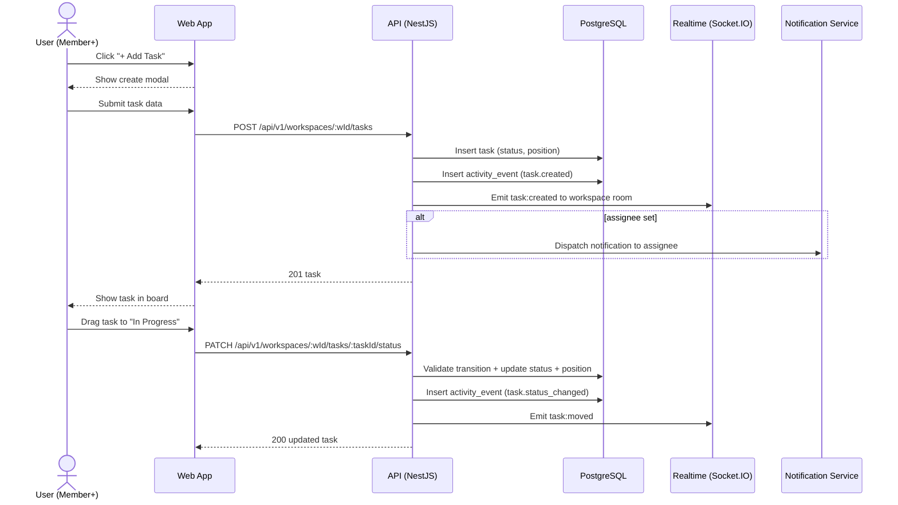

Source: CollabSphere — Ultimate Product & Technical Documentation.md
Sections included: §4.7, §4.7.1, §4.7.10, §4.7.11, §4.7.12, §4.7.13, §4.7.14, §4.7.15, §4.7.2, §4.7.3, §4.7.4, §4.7.5, §4.7.6, §4.7.7, §4.7.8, §4.7.9

# §4.7 FL-006 — Task Lifecycle (Create → Assign → Move Across Kanban Board)

## §4.7.1 Goal

Enable workspace members to create tasks, assign them (Manager+), and track progress visually through a Kanban board (and list view). Task updates must be reflected in real-time for all viewers in the workspace.

This flow covers:
- Task creation (minimal friction)
- Assignment and notifications
- Status transitions (drag-and-drop + dropdown)
- Due dates and reminders
- Priority levels
- Task detail panel with comments

---

## §4.7.2 Actors

- **Primary:** Member+ (creates tasks, updates own tasks)
- **Primary:** Manager+ (assigns tasks, updates any task, bulk ops)
- **Secondary:** Viewer (read-only)
- **System:** Notifications, activity logging, deadline reminders, realtime broadcaster

---

## §4.7.3 Preconditions

- User is authenticated
- User is a workspace member
- Workspace task board exists (created by template or default board)
- User has permissions:
  - Create task: Member+
  - Assign to others: Manager+
  - Move tasks across statuses: per RBAC + state rules
- Realtime connection established (Socket.IO or SSE). If realtime unavailable, polling must work.

---

## §4.7.4 Postconditions (Success)

- Task exists in DB with required fields
- Task appears on Kanban board in correct column
- If assigned:
  - Assignee receives in-app notification (and email if enabled)
- Activity feed reflects significant task events (created, assigned, completed)
- Real-time event broadcast updates other clients

---

## §4.7.5 Task Domain Model (v1)

### Required Task Fields

| Field | Type | Required | Constraints | Default |
|------|------|----------|------------|---------|
| id | UUID | auto | — | — |
| workspaceId | UUID | yes | FK | — |
| title | string | yes | 1–200 chars | — |
| description | plain text | no | max 10,000 chars | null |
| status | enum | yes | see §4.7.6 | `todo` |
| priority | enum | no | `low` `medium` `high` `urgent` | `medium` |
| assigneeId | UUID | no | must be workspace member | null |
| reporterId | UUID | yes | set from auth user | — |
| dueDate | date | no | date-only; optional | null |
| labels | string[] | no | max 10 labels | [] |
| position | decimal | yes | for ordering in column | auto |
| createdAt | timestamp | auto | — | now |
| updatedAt | timestamp | auto | — | now |
| deletedAt | timestamp | no | soft delete | null |

> Note: Keep dueDate as **date-only** (no time) in v1 to simplify UX and reminders.

---

## §4.7.6 Task Status State Machine (v1)

### Statuses (Canonical)
- `backlog` (optional column; enabled by template)
- `todo`
- `in_progress`
- `in_review`
- `done`
- `cancelled` (P2)
- `archived` (system-only, for retention policies)

### Default Kanban Columns (v1)
- To Do
- In Progress
- Review
- Done

Templates may add Backlog.

### Allowed Transitions

| From | To | Who Can Do It | Notes |
|------|----|----------------|------|
| backlog | todo | Member+ | |
| todo | in_progress | Assignee OR Manager+ | |
| in_progress | in_review | Assignee OR Manager+ | |
| in_review | in_progress | Manager+ | “Changes requested” flow |
| in_review | done | Manager+ OR Owner/Admin | Optional: allow assignee to self-complete if policy says so |
| done | in_progress | Manager+ | Reopen |
| any | cancelled | Manager+ | Requires reason comment (P2) |

---

## §4.7.7 UI/UX — Kanban Board

### Route
- `/w/:workspaceId/tasks` (default)

### Layout (Desktop)
- Horizontal columns with sticky headers
- Each column shows:
  - Column name
  - Task count
  - “+ Add Task” button (Member+)
- Cards show:
  - Title (2-line clamp)
  - Priority indicator (icon + color)
  - Assignee avatar (or “Unassigned” pill)
  - Due date badge (red if overdue)
  - Comment count (if >0)
  - Up to 2 labels + “+N”

### Interactions
| Interaction | Expected Behavior |
|-------------|-------------------|
| Drag task card | Shows valid drop targets only; invalid columns show “no-drop” cursor and tooltip |
| Drop task card | Optimistic UI update; calls status update endpoint; on failure snap back + toast |
| Click task card | Opens task detail slide-over panel (right side) |
| Click “+ Add Task” | Opens create task modal with status preset to that column |
| Filter bar | Filter by assignee, priority, label, due date, status |
| Sort | Sort within column: manual order (default), due date, priority |
| Keyboard move | `M` to move focused task → choose column → Enter |

### Mobile Behavior
- Default view becomes task list (recommended)
- Board view (optional) uses horizontal swipe between columns

---

## §4.7.8 UI/UX — Create Task Modal

Fields (v1):
- Title (required)
- Description (optional)
- Assignee (optional; only Manager+ can assign to others; Members can self-assign)
- Due date (optional)
- Priority (optional)
- Labels (optional, P2)

Buttons:
- Cancel
- Create Task

Validation:
- Title required (1–200)
- Due date cannot be in the past (soft enforcement: show warning; hard enforcement recommended)
- Assignee must be member

---

## §4.7.9 UI/UX — Task Detail Panel

Opens as slide-over panel on desktop/tablet; full page on mobile.

Sections:
1. Header
   - Title (inline editable if permission)
   - Status dropdown
   - Close button
2. Metadata
   - Assignee picker
   - Due date picker
   - Priority dropdown
   - Labels (P2)
3. Description
   - Plain text editor (no rich text in v1)
4. Comments
   - Threaded comments
5. Activity (P2)
   - timeline of status/assignment changes
6. Danger Zone
   - Delete task (Manager+; confirm dialog)

---

## §4.7.10 Realtime Behavior

When a task changes, the system broadcasts an event to all workspace members currently connected.

Recommended room:
- `workspace:<workspaceId>`

Events:
- `task:created`
- `task:updated`
- `task:deleted`
- `task:moved` (status + position)
- `task:assigned`

Payload includes minimal fields + task id; clients may refetch if needed.

---

## §4.7.11 Sequence Diagram (Mermaid)



---

## §4.7.12 API Contracts (Flow-Level Summary)

### `POST /api/v1/workspaces/:workspaceId/tasks`

**Auth:** Required  
**Role:** Member+  
Request:
```json
{
  "title": "Implement login page",
  "description": "Build the login UI and connect auth endpoints.",
  "status": "todo",
  "priority": "high",
  "assigneeId": "uuid-or-null",
  "dueDate": "2025-08-01",
  "labels": ["frontend", "auth"]
}
```

Response (201):
```json
{
  "data": {
    "task": {
      "id": "uuid",
      "title": "Implement login page",
      "status": "todo",
      "priority": "high",
      "assigneeId": "uuid-or-null",
      "dueDate": "2025-08-01",
      "position": 5.0,
      "createdAt": "2025-07-17T12:00:00Z"
    }
  }
}
```

Errors:
- `400 VALIDATION_ERROR`
- `403 FORBIDDEN`
- `404 WORKSPACE_NOT_FOUND`
- `400 INVALID_ASSIGNEE`
- `400 TASK_LIMIT_REACHED` (optional quota)

---

### `GET /api/v1/workspaces/:workspaceId/tasks`

Supports two views:
- `view=list` (flat list, paginated)
- `view=board` (grouped by status)

Query params:
- `status=todo,in_progress`
- `assigneeId=...`
- `priority=high,urgent`
- `dueBefore=YYYY-MM-DD`
- `dueAfter=YYYY-MM-DD`
- `search=...`
- `page`, `pageSize`
- `sortBy`, `sortOrder`

---

### `PATCH /api/v1/workspaces/:workspaceId/tasks/:taskId/status`

**Role:** Assignee or Manager+ depending on transition rules.

Request:
```json
{
  "toStatus": "in_progress",
  "positionAfter": 3.5
}
```

Errors:
- `400 INVALID_TRANSITION`
- `403 FORBIDDEN`

---

### `PATCH /api/v1/workspaces/:workspaceId/tasks/:taskId/assign`

**Role:** Manager+ (Members can self-assign if enabled)

Request:
```json
{
  "assigneeId": "uuid-or-null"
}
```

Errors:
- `400 INVALID_ASSIGNEE`
- `403 FORBIDDEN`

---

## §4.7.13 Events Emitted

| Event | Trigger | Payload |
|-------|---------|---------|
| `task.created` | Task created | `{ workspaceId, taskId, actorId }` |
| `task.updated` | Fields changed | `{ workspaceId, taskId, changes }` |
| `task.assigned` | Assignee changed | `{ workspaceId, taskId, fromAssigneeId, toAssigneeId }` |
| `task.status_changed` | Status changed | `{ workspaceId, taskId, from, to }` |
| `task.deleted` | Soft delete | `{ workspaceId, taskId }` |
| `deadline.reminder_due` | dueDate approaching | `{ taskId, assigneeId }` |

---

## §4.7.14 Edge Cases

| Edge Case | Expected Behavior |
|----------|-------------------|
| Member tries to assign task to others | Blocked. UI hides assignee picker for non-Manager unless self-assign mode enabled. API returns 403. |
| Drag to invalid column | UI shows tooltip “You can’t move this task to Done directly.” Snap back. |
| Two users move same task simultaneously | Last write wins. Realtime update resolves final state. |
| Due date in the past | Return 400 invalid date (recommended). UI prevents selection of past dates. |
| Assignee removed from workspace | Task becomes unassigned automatically. Activity event logged. |
| Workspace has 500+ tasks | Enforce quota (optional). Return 400 TASK_LIMIT_REACHED. |
| Viewer attempts edits | Read-only everywhere. Server blocks writes. |
| Realtime unavailable | Polling fallback every 10–15s on board/list views. Show “Live updates unavailable” banner. |

---

## §4.7.15 Observability (Flow-Specific)

Metrics:
- `task.create.count`
- `task.status_change.count` (labels: from, to)
- `task.api.latency_ms` (per endpoint)
- `task.realtime.broadcast_latency_ms`

Logs:
- `task_created` (info)
- `task_status_changed` (info)
- `task_transition_denied` (warn)
- `task_assign_failed_invalid_member` (warn)
- `task_query_slow` (warn if >500ms)

---

