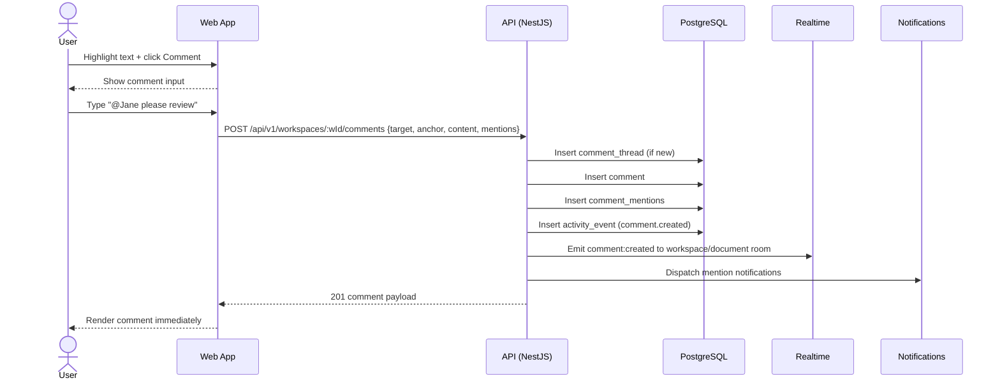

Source: CollabSphere — Ultimate Product & Technical Documentation.md
Sections included: §4.8, §4.8.1, §4.8.10, §4.8.11, §4.8.12, §4.8.13, §4.8.14, §4.8.15, §4.8.2, §4.8.3, §4.8.4, §4.8.5, §4.8.6, §4.8.7, §4.8.8, §4.8.9

# §4.8 FL-007 — Commenting + Mentions (Documents + Tasks)

## §4.8.1 Goal

Enable users to discuss work contextually by attaching threaded comments to:
- **Documents** (inline/anchored and general comments)
- **Tasks** (task discussion thread)

Mentions (`@Name`) must notify the mentioned user(s) and link them back to the exact context.

This flow must support:
- Threaded replies
- Editing/deleting own comments (time-limited)
- Resolving comment threads (Manager+)
- Real-time updates (comments appear instantly to other viewers)

---

## §4.8.2 Actors

- **Primary:** Workspace members (Member+), Viewer (limited commenting per §2.3.4)
- **Secondary:** Mentioned user(s)
- **System:** Notification dispatcher, realtime broadcaster, activity logger

---

## §4.8.3 Preconditions

- User is authenticated
- User can view the target document/task
- User has permission to comment (see §2.3.4)
- For document inline comments: editor supports anchored ranges (Tiptap/ProseMirror integration)
- Realtime channel is available (Socket.IO recommended)

---

## §4.8.4 Postconditions (Success)

- Comment is persisted in DB
- Comment appears in UI immediately
- Realtime event broadcasts comment to other clients
- If `@mentions` exist:
  - Mentioned users receive notifications (in-app; email optional based on preferences)
- Activity feed records comment creation for workspace context (coalesced)

---

## §4.8.5 Comment Types (v1)

CollabSphere supports two comment surfaces:

### A) Document Comments
1. **Inline (anchored) comments** — attached to a range of text in a document
2. **General document comments** — attached to the document as a whole (not anchored)

> Implementation note: anchored comments are **in scope for v1**. Store a stable anchor reference compatible with ProseMirror/Yjs (e.g., using ProseMirror decorations and a mapping strategy) and degrade gracefully if resolution fails after edits.

### B) Task Comments
- Thread attached to a specific task, chronological display

---

## §4.8.6 Data Model (Conceptual)

### Core Entities
- `comments` — one row per comment message
- `comment_threads` — one row per thread, can be resolved
- `comment_mentions` — link table mapping comment → mentioned user(s)

### Polymorphic Target
A thread targets either:
- `document` (optionally anchored), or
- `task`

Recommended schema:
- `comment_threads.target_type` enum: `document` | `task`
- `comment_threads.target_id` UUID

Anchoring data:
- `comment_threads.anchor` JSONB nullable
  - Stores selection/range metadata for documents only

---

## §4.8.7 UI/UX — Document Comments

### Entry Points
- In document editor toolbar: Comment button
- Inline selection bubble: “Comment” icon when text selected
- Right sidebar: Comments panel showing all threads for this document
- Command palette: “Open comments” (P2)

### Creating an Inline Comment (anchored)
1. User highlights text
2. Clicks “Comment”
3. A comment input box appears (popover or sidebar focus)
4. User types message with optional @mentions
5. Click “Post”
6. Thread appears in sidebar and anchored marker appears in document margin

### Creating a General Document Comment
1. Open comments panel
2. Type in “New comment” box at top
3. Post

### Comment Display Rules
- Threads sorted by:
  - Anchor position in document order (anchored)
  - CreatedAt descending (general)
- Each thread shows:
  - Author avatar + name
  - Timestamp (“2h ago”)
  - Content (markdown-lite)
  - Reply count
  - Resolve button (Manager+)
  - “Jump to” button for anchored threads (scrolls to text)
- Resolved threads hidden by default with “Show resolved” toggle

### Editing/Deleting
- Only author can edit/delete
- Time windows per §2.3.4:
  - Viewer/Member: edit within 15 min
  - Manager: within 30 min
  - Admin: within 1 hour
  - Owner: within 1 hour
- After edit window, UI hides “Edit” option

---

## §4.8.8 UI/UX — Task Comments

### Entry Points
- Task detail panel: Comments section
- Task list: comment icon on row (opens panel)

### Behavior
- Comments are chronological (oldest → newest)
- Threading:
  - v1 supports threaded replies (recommended) OR simple flat list
  - If flat list in v1, treat replies as v1.1 improvement
- Mentions supported same as documents
- Realtime update:
  - Other users viewing the task detail see new comment appear instantly
  - If not viewing, they see unread indicator on task card (P2)

---

## §4.8.9 Mentions (`@`) Specification

### Mention UX
- Typing `@` opens user autocomplete
- List shows workspace members (and optionally global users for admins)
- Searching filters by name/email
- Selecting inserts mention token into the text (not plain string)
- Mention tokens render with highlight (e.g., blue pill)

### Mention Parsing Rules
- Mention token stores:
  - `userId`
  - display label (name)
- On save, backend extracts all mention tokens and persists into `comment_mentions`

### Mention Notification Rule
- When a comment is created:
  - For each mentioned userId:
    - Create notification `mention.comment`
    - Send email if user preference enabled
- Avoid duplicate mention notifications:
  - If user mentioned multiple times in same comment, notify once

---

## §4.8.10 Realtime Events

Room:
- `workspace:<workspaceId>` for general updates
- Optional `document:<documentId>` and `task:<taskId>` rooms for scoped updates

Events:
- `comment:thread_created`
- `comment:created`
- `comment:updated`
- `comment:deleted`
- `comment:thread_resolved`
- `comment:thread_reopened`

Payload:
- Always include:
  - `threadId`
  - `commentId` (when applicable)
  - `targetType` + `targetId`
  - minimal comment fields

---

## §4.8.11 Sequence Diagram (Mermaid)



---

## §4.8.12 API Contracts (Flow-Level Summary)

### `POST /api/v1/workspaces/:workspaceId/comments`

Creates a comment (and thread if needed).

Request:
```json
{
  "targetType": "document",
  "targetId": "doc-uuid",
  "threadId": null,
  "anchor": {
    "type": "textRange",
    "from": 120,
    "to": 156,
    "quote": "the highlighted text"
  },
  "content": {
    "type": "doc",
    "content": [
      { "type": "paragraph", "content": [
        { "type": "text", "text": "Please review " },
        { "type": "mention", "attrs": { "userId": "user-uuid", "label": "Jane Doe" } }
      ]}
    ]
  }
}
```

Response (201):
```json
{
  "data": {
    "thread": {
      "id": "thread-uuid",
      "targetType": "document",
      "targetId": "doc-uuid",
      "anchor": { "type": "textRange", "from": 120, "to": 156, "quote": "..." },
      "status": "open",
      "createdAt": "2025-07-17T12:00:00Z"
    },
    "comment": {
      "id": "comment-uuid",
      "threadId": "thread-uuid",
      "author": { "id": "user-uuid", "fullName": "Alice", "avatarUrl": null },
      "content": { "...": "tiptap-json" },
      "createdAt": "2025-07-17T12:00:00Z"
    }
  }
}
```

Errors:
- `403 FORBIDDEN` (no comment permission)
- `404 TARGET_NOT_FOUND`
- `400 VALIDATION_ERROR` (empty content)
- `400 INVALID_ANCHOR` (anchor malformed)

---

### `GET /api/v1/workspaces/:workspaceId/comments`

Query params:
- `targetType=document|task`
- `targetId=...`
- `status=open|resolved|all`
- pagination

---

### `PATCH /api/v1/workspaces/:workspaceId/comments/:commentId`

Edits a comment (within allowed window).

Request:
```json
{ "content": { "...": "new tiptap json" } }
```

Errors:
- `403 EDIT_WINDOW_EXPIRED`
- `403 FORBIDDEN`

---

### `DELETE /api/v1/workspaces/:workspaceId/comments/:commentId`

Soft-deletes the comment (or hard delete if within short window; choose one strategy and document it).

---

### `POST /api/v1/workspaces/:workspaceId/comment-threads/:threadId/resolve`

Role: Manager+  
Behavior: marks thread resolved, hides by default.

---

## §4.8.13 Events Emitted

| Event | Trigger | Payload |
|-------|---------|---------|
| `comment.thread_created` | New thread created | `{ workspaceId, threadId, targetType, targetId, actorId }` |
| `comment.created` | Comment posted | `{ workspaceId, threadId, commentId, actorId, mentions[] }` |
| `comment.updated` | Comment edited | `{ workspaceId, commentId, actorId }` |
| `comment.deleted` | Comment removed | `{ workspaceId, commentId, actorId }` |
| `comment.thread_resolved` | Thread resolved | `{ workspaceId, threadId, resolverId }` |
| `notification.mention_created` | Mention notification | `{ mentionedUserId, commentId, threadId }` |

---

## §4.8.14 Edge Cases

| Edge Case | Expected Behavior |
|----------|-------------------|
| User mentions someone not in workspace | Autocomplete should prevent selection. If forced, API rejects with 400 INVALID_MENTION. |
| Viewer commenting on tasks | If not allowed by §2.3.4, UI hides input; API returns 403 if attempted. |
| User deletes parent comment with replies | Thread remains; comment shows “Deleted comment” placeholder. Replies remain intact. |
| Anchor becomes invalid after document edits | Anchored thread shows “Original text changed” badge; still accessible via thread list. (Hard problem; acceptable for v1 to degrade gracefully.) |
| Large comment threads | Paginate replies after N=50. |
| Race conditions in realtime | Last-write-wins for edits. Thread resolve conflicts handled by updatedAt ordering. |
| XSS attempts in comments | Sanitize on server and client. Store structured content (Tiptap JSON) rather than raw HTML. |

---

## §4.8.15 Observability

Metrics:
- `comment.created.count` (by targetType)
- `comment.mention.count`
- `comment.api.latency_ms`
- `comment.realtime.broadcast_latency_ms`

Logs:
- `comment_created` (info)
- `comment_edited` (info)
- `comment_edit_denied_window_expired` (warn)
- `comment_target_not_found` (warn)
- `comment_sanitize_stripped_content` (warn)

---

