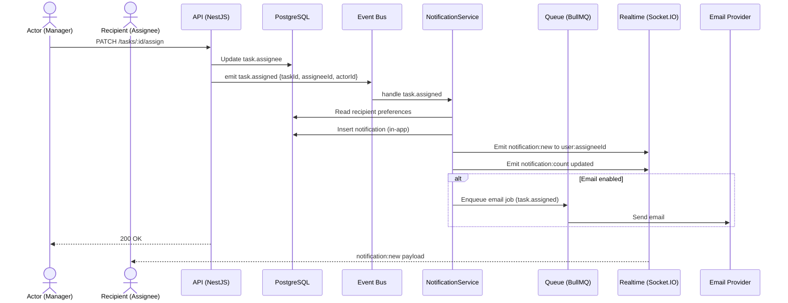

Source: CollabSphere — Ultimate Product & Technical Documentation.md
Sections included: §4.9, §4.9.1, §4.9.10, §4.9.11, §4.9.12, §4.9.13, §4.9.14, §4.9.15, §4.9.16, §4.9.2, §4.9.3, §4.9.4, §4.9.5, §4.9.6, §4.9.7, §4.9.8, §4.9.9

# §4.9 FL-008 — Notifications (In-App + Email)

## §4.9.1 Goal

Ensure users never miss important workspace activity by delivering timely notifications through:
- **In-app notifications** (P0 — required for v1 launch)
- **Email notifications** (P1 — essential usability, configurable)

Notifications must be:
- **Relevant** (triggered by meaningful events)
- **Scoped** (never leak cross-workspace data)
- **Configurable** (users control what they receive)
- **Reliable** (queued delivery + retries for email)
- **Real-time** (in-app updates via sockets)

---

## §4.9.2 Actors

- **Primary:** All authenticated users
- **Secondary:** System (notification dispatcher, email worker, realtime broadcaster)
- **Optional:** Platform Admin (for system announcements/audit views)

---

## §4.9.3 Preconditions

- User is authenticated
- For workspace-related notifications, user is/was a member of the workspace
- Notification event system is operational
- Email provider configured (for email channel)
- Realtime channel operational (Socket.IO) OR fallback polling enabled
- Fallback polling interval (v1): every 30 seconds

---

## §4.9.4 Postconditions (Success)

- Notification record is created and stored
- In-app notification appears:
  - in notification bell dropdown
  - in notification center page
  - unread count increments
- If email is enabled for that notification type:
  - Email job enqueued
  - Email delivered or retried
- Notification is scoped to the correct user and (where applicable) workspace
- Activity feed may also update separately (notifications and activity are distinct)

---

## §4.9.5 Notification Types (v1)

### Workspace-scoped notifications (most common)

| Type Key | Trigger | Recipient(s) |
|---------|---------|--------------|
| `workspace.invite` | User invited to workspace | invited user (by email/userId) |
| `workspace.member_joined` | Invite accepted / member joins | workspace Owner/Admin (optional) |
| `document.comment` | Comment created on document | document watchers (default: participants), author, mentioned users |
| `document.mention` | User mentioned in document comment | mentioned user |
| `document.submitted` *(Academic)* | Document submitted for review | Owner (Supervisor) + Admins |
| `document.review_requested_changes` *(Academic)* | Supervisor requests changes | document author(s) / workspace members (policy-based) |
| `document.review_approved` *(Academic)* | Supervisor approves | document author(s) |
| `task.assigned` | Task assigned | assignee |
| `task.mention` | Mention in task comment | mentioned user |
| `task.comment` | Comment on task | task participants, assignee, mentioned users |
| `task.due_soon` | Due within 24h | assignee + Manager (optional) |
| `task.overdue` | Past due date | assignee + Manager (optional) |
| `workspace.announcement` | Announcement posted | all workspace members |

### Global notifications (rare in v1)

| Type Key | Trigger | Recipient(s) |
|---------|---------|--------------|
| `platform.announcement` | Platform admin announcement | all users |
| `security.password_changed` | Password changed | that user |
| `security.new_login` (optional) | New login from new device | that user |

> Scope rule: Workspace notifications must always include `workspaceId`. Global notifications have `workspaceId = null`.

---

## §4.9.6 Delivery Channels

### Channel A — In-App (P0)
- Stored notifications displayed via:
  - bell dropdown (last 10)
  - notifications center (paginated list)
- Real-time updates:
  - push new notifications to recipient via Socket.IO room `user:<userId>`
- In-app delivery is considered successful once persisted to DB + pushed (push is best-effort)

### Channel B — Email (P1)
- Emails sent via background worker (BullMQ)
- Email delivery is **best-effort** with retries
- Users can disable/enable email per notification type in preferences
- Two modes:
  - **Instant** (e.g., task assigned, mention)
  - **Digest** (daily/weekly summary; v1 can start with daily)

---

## §4.9.7 UI/UX — Notification Bell + Dropdown

### Bell in Top Navigation
- Visible on all authenticated pages
- Shows unread badge:
  - hidden when count=0
  - shows `99+` when count ≥ 100
- Accessible:
  - `aria-label="Notifications"`
  - unread badge includes `aria-label="X unread notifications"`

### Dropdown Behavior
- Click bell opens dropdown:
  - shows last 10 notifications (most recent first)
  - each item shows:
    - icon (type-based)
    - title
    - short body preview
    - timestamp (relative)
    - unread indicator dot
  - actions:
    - “Mark all as read”
    - “View all” → `/notifications`
- Clicking a notification:
  - marks it read (optimistic)
  - navigates to its target resource:
    - document, task, comments thread, workspace, etc.

### Loading/Empty/Error States
- Loading: skeleton list
- Empty: “You’re all caught up!”
- Error: “Failed to load notifications” + Retry

---

## §4.9.8 UI/UX — Notification Center Page

### Route
- `/notifications`

### Features
- Paginated list (25/page default)
- Filters:
  - Unread only
  - Workspace (dropdown)
  - Type category (Tasks, Documents, Mentions, System)
- Bulk actions:
  - Mark selected as read
  - Mark all as read
  - Delete notification (optional v1.1; in v1 can keep immutable)
- Each item:
  - richer details than dropdown (full body)
  - “Go to” link
  - “Mark as read/unread” toggle (optional; v1 can only mark read)

---

## §4.9.9 UI/UX — Notification Preferences

### Route
- `/settings/notifications`

### Preference Matrix (v1)
User can toggle (in-app and email separately):

| Preference | In-App Toggle | Email Toggle | Default |
|------------|---------------|-------------|---------|
| Task assigned to me | ✅ | ✅ | ON / ON |
| Task due soon / overdue | ✅ | ✅ | ON / ON |
| Comments on tasks I’m involved in | ✅ | ✅ | ON / OFF |
| Comments on documents I’m involved in | ✅ | ✅ | ON / OFF |
| @Mentions anywhere | ✅ | ✅ | ON / ON |
| Academic: document submitted (Supervisor) | ✅ | ✅ | ON / ON |
| Academic: review decision (Students) | ✅ | ✅ | ON / ON |
| Workspace announcements | ✅ | ✅ | ON / OFF |
| Platform announcements | ✅ | ✅ | ON / OFF |
| Daily digest | N/A | ✅ | OFF |
| Weekly digest | N/A | ✅ | OFF |

Rules:
- If in-app toggle is OFF, do not create in-app notification records for that type
- If email toggle is OFF, do not enqueue email jobs for that type
- Mentions should strongly default ON for both channels

---

## §4.9.10 Event-Driven Notification Dispatch

CollabSphere uses an internal event bus. Business services emit domain events; NotificationService listens and decides:
- whether to create an in-app notification
- whether to send email
- who recipients are
- what content to render

### Example: Task assigned
- Domain emits: `task.assigned`
- NotificationService handler:
  - recipient: `assigneeId`
  - type: `task.assigned`
  - respects preferences
  - creates notification record
  - enqueues email job (if enabled)
  - emits realtime push `notification:new` to `user:<assigneeId>`

---

## §4.9.11 Realtime Events

Rooms:
- `user:<userId>` for personal notification pushes
- Optional: `workspace:<workspaceId>` for workspace announcements

Events:
- `notification:new` — push new notification payload
- `notification:count` — updated unread count
- `notification:read` — ack read (optional)
- `notification:batch_read` — mark all read (optional)

Payload for `notification:new`:
```json
{
  "id": "notif-uuid",
  "type": "task.assigned",
  "workspaceId": "workspace-uuid",
  "title": "Task assigned to you",
  "body": "Implement login page",
  "actor": { "id": "user-uuid", "fullName": "Jane Doe", "avatarUrl": null },
  "resource": { "type": "task", "id": "task-uuid" },
  "isRead": false,
  "createdAt": "2025-07-17T12:00:00Z"
}
```

---

## §4.9.12 Data Model (v1)

### `notifications` table (conceptual)
| Column | Type | Notes |
|--------|------|------|
| id | UUID | primary key |
| recipient_id | UUID | user who receives it |
| workspace_id | UUID nullable | null for global |
| actor_id | UUID nullable | who caused it (null for system) |
| type | varchar | e.g., `task.assigned` |
| title | varchar(200) | short title |
| body | text nullable | optional additional detail |
| resource_type | varchar | `task`, `document`, `comment_thread`, `workspace` |
| resource_id | UUID nullable | |
| url | varchar nullable | deep link (frontend route) |
| metadata | jsonb | flexible extras (dueDate, status, etc.) |
| is_read | boolean | default false |
| read_at | timestamptz nullable | |
| created_at | timestamptz | |
| deleted_at | timestamptz nullable | (optional v1.1) |

Indexes:
- `(recipient_id, is_read, created_at DESC)`
- `(recipient_id, workspace_id, created_at DESC)`

Retention:
- v1 policy: keep last 90 days OR last 2,000 notifications per user (whichever smaller)
- cleanup via background job

### `notification_preferences` table (conceptual)
- user_id (PK/FK)
- per-type toggles stored as JSONB:
  - `in_app: { "task.assigned": true, ... }`
  - `email: { "task.assigned": true, ... }`
- digest settings:
  - `daily_digest_enabled`
  - `weekly_digest_enabled`

---

## §4.9.13 Sequence Diagram (Mermaid)



---

## §4.9.14 API Contracts (Flow-Level Summary)

### `GET /api/v1/notifications/unread-count`

**Auth:** Required

Response:
```json
{ "data": { "unreadCount": 12 } }
```

Errors:
- `401 UNAUTHORIZED`

---

### `GET /api/v1/notifications`

Query params:
- `page`, `pageSize`
- `unreadOnly=true|false`
- `workspaceId=...` (optional)
- `types=task.assigned,document.mention` (optional)

Response (200):
```json
{
  "data": {
    "items": [
      {
        "id": "notif-uuid",
        "type": "task.assigned",
        "workspaceId": "workspace-uuid",
        "title": "Task assigned to you",
        "body": "Implement login page",
        "url": "/w/workspace-uuid/tasks/task-uuid",
        "isRead": false,
        "createdAt": "2025-07-17T12:00:00Z"
      }
    ]
  },
  "meta": {
    "pagination": { "page": 1, "pageSize": 25, "totalItems": 120, "totalPages": 5 }
  }
}
```

---

### `PATCH /api/v1/notifications/:id/read`

Request:
```json
{ "isRead": true }
```

Response:
```json
{ "data": { "id": "notif-uuid", "isRead": true, "readAt": "2025-07-17T12:05:00Z" } }
```

Errors:
- `404 NOT_FOUND` (if not owned by user)
- `403 FORBIDDEN` (attempt to modify others’ notifications)

---

### `PATCH /api/v1/notifications/mark-all-read`

Response:
```json
{ "data": { "updatedCount": 42 } }
```

---

### `GET /api/v1/notification-preferences`

Response:
```json
{
  "data": {
    "inApp": { "task.assigned": true, "document.mention": true },
    "email": { "task.assigned": true, "document.mention": true },
    "dailyDigestEnabled": false,
    "weeklyDigestEnabled": false
  }
}
```

---

### `PUT /api/v1/notification-preferences`

Request:
```json
{
  "inApp": { "task.assigned": true, "workspace.announcement": false },
  "email": { "task.assigned": true, "workspace.announcement": false },
  "dailyDigestEnabled": true,
  "weeklyDigestEnabled": false
}
```

Errors:
- `400 VALIDATION_ERROR` (unknown type keys)

---

## §4.9.15 Edge Cases

| Edge Case | Expected Behavior |
|----------|-------------------|
| User switches workspace | Notification dropdown and center show all notifications by default; filters allow workspace-only view. Unread count is global (unless you explicitly want per-workspace badges later). |
| Recipient removed from workspace | Notifications already delivered remain in history, but future workspace events should not notify removed users. |
| High notification volume | Pagination required; indexes must support unread count. Apply retention policy and cleanup job. |
| Email provider failure | Email job retries with exponential backoff. In-app notification still appears. |
| Notification preference changed mid-stream | Apply preference at dispatch time; do not retroactively remove old notifications. |
| Duplicate events | Use idempotency keys per event (e.g., `eventId`) to prevent duplicate notifications. |
| Mention spamming | Rate limit comment creation; optionally dedupe repeated mention notifications within short window. |
| Data leakage risk | All notification queries must filter by `recipient_id = currentUserId`. Workspace scoping only affects filtering, not authorization. |

---

## §4.9.16 Observability

### Metrics
- `notifications.created.count` (labels: type, channel=in_app/email)
- `notifications.unread.count` (gauge per user—sampled)
- `email.jobs.enqueued.count`
- `email.jobs.failed.count`
- `email.delivery.latency_ms`
- `notifications.api.latency_ms` (per endpoint)
- `notifications.realtime.push_latency_ms`

### Logs
- `notification_created` (info): notificationId, type, recipientId, workspaceId
- `notification_dispatch_skipped_preference` (info): type, recipientId
- `email_send_attempt` (info): jobId, template, recipientEmail
- `email_send_failed` (error): jobId, error
- `notification_query_slow` (warn): queryTimeMs, userId

---

